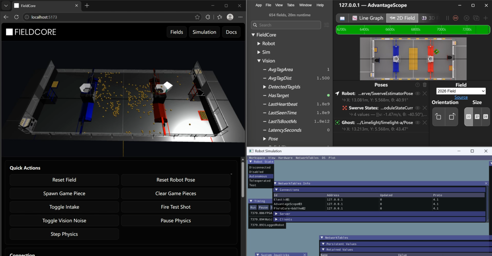

<p align="center">
  
</p>

<p align="center">
  A browser-based FRC field physics simulator for testing robot code, game pieces, intake/shooter behavior, and vision pose correction through NetworkTables.
</p>

<p align="center">
  <strong>React</strong> | <strong>Vite</strong> | <strong>Babylon.js</strong> | <strong>Havok Physics</strong> | <strong>NT4</strong> | <strong>WPILib-friendly</strong>
</p>

<p align="center">
  <a href="https://fieldcore.0pen.top"><strong>fieldcore.0pen.top</strong></a>
</p>



## What Is FieldCore?

FieldCore is an unofficial, real-time FRC field simulator designed to make robot-code testing feel closer to a physical field.

Instead of only replaying logs or drawing a robot pose, FieldCore runs a browser-hosted 3D physics world. It can load an official-style field model, simulate game pieces, intake collection, shooter launches, robot motion, collision, and vision-derived pose measurements while communicating with robot code over NetworkTables.

FieldCore is not an AdvantageScope replacement and is not an official FIRST tool. It is intended to complement normal WPILib simulation, AdvantageScope visualization, and team-specific robot-code workflows.

## Highlights

- 3D FRC field simulation powered by Babylon.js and Havok Physics.
- 2026 REBUILT field module using AdvantageScope-compatible field assets.
- Fuel game piece physics, staged field pieces, intake collection, and shooter launch simulation.
- Configurable robot body, intake geometry, shooter velocity, and simulation behavior from the UI.
- NT4 connection path for WPILib robot code.
- Limelight-style / vision-pose publishing so robot code can apply its own pose-estimator correction.
- FieldCore-specific topics for physical pose, vision pose, game-piece state, intake state, and shooter events.
- Modular field architecture for adding future FRC games and custom fields.

## Quick Start

### Requirements

- Node.js 20 or newer
- npm
- A modern Chromium-based browser is recommended for best WebGL and WebAssembly performance

### Run Locally

```bash
npm install
npm run dev
```

Open the Vite URL shown in the terminal, then select `2026 REBUILT Field`.

### Build

```bash
npm run build
```

### Check Logic And Types

```bash
npm run typecheck
npm run test:logic
```

## Robot Code Integration

FieldCore is designed around one rule: the simulator publishes physical-world truth and vision-like measurements, while robot code remains responsible for estimator logic.

Recommended flow:

1. Start the WPILib robot simulation or robot program with NT4 enabled.
2. Start FieldCore with `npm run dev`.
3. In FieldCore, connect to the robot NT server.
4. Let FieldCore read robot module states or chassis speeds.
5. Let FieldCore simulate the real robot pose through physics.
6. Read the published vision pose in robot code and call `poseEstimator.addVisionMeasurement(...)`.

Do not use `/FieldCore/Sim/TrueRobotPose` as the robot estimator pose. That topic is debug-oriented. Robot code should consume the vision-style pose topics and decide how to fuse them.

See the detailed integration guide:

- [10541 Robot Integration Guide](./docs/FIELDCORE_10541_ROBOT_INTEGRATION.md)
- [NetworkTables Topics](./src/docs/nt-topics.md)
- [General Integration Notes](./src/docs/integration.md)

## NetworkTables Behavior

FieldCore can operate in a physics-first simulation mode:

- The first robot pose estimate can initialize the simulated physical robot.
- Ongoing motion is driven from swerve module states, with chassis speeds as a fallback.
- FieldCore publishes the resulting physical pose to FieldCore vision topics and Limelight-compatible topics such as `botpose_wpiblue`.
- Robot code can treat those values like a perfect simulated camera result, then run its normal estimator correction path.

This keeps simulated field truth, robot odometry, and estimator correction separated in the same way they are separated on a real robot.

## Project Structure

```text
fieldcore/
  public/
    assets/
      brand/              FieldCore logo and icon
      fields/frc2026/     2026 field and game-piece assets
      havok/              Havok WebAssembly runtime
  src/
    app/                  React shell, routing, theme
    core/                 Physics, NT, objects, math, vision systems
    modules/fields/       Field module definitions
    ui/                   Pages and configuration panels
  docs/                   Product notes, plans, integration docs, README media
```

## Field And Asset Sources

FieldCore references official and community FRC resources to match the 2026 field as closely as possible.

- 2026 REBUILT game manual: <https://firstfrc.blob.core.windows.net/frc2026/Manual/Translations/2026GameManual-CS.pdf>
- AdvantageScope source: <https://github.com/Mechanical-Advantage/AdvantageScope>
- AdvantageScope 2026 field asset package: <https://github.com/Mechanical-Advantage/AdvantageScopeAssets/releases/download/archive-v1/Field3d_2026FRCFieldV1.zip>

## Documentation

- [Productization Plan](./docs/FIELDCORE_2026_PRODUCTIZATION.md)
- [Development Plan](./docs/FIELDCORE_DEVELOPMENT_PLAN.md)
- [Todo List](./docs/FIELDCORE_TODO.md)
- [Field Module Authoring](./src/docs/field-module-authoring.md)

## Status

FieldCore is under active development. The current focus is accurate FRC physics behavior, reliable NT4 integration, clean robot-code handoff, and a practical UI for team simulation workflows.

## Disclaimer

FieldCore is an independent project. It is not affiliated with or endorsed by FIRST, WPILib, Limelight, or Mechanical Advantage.
